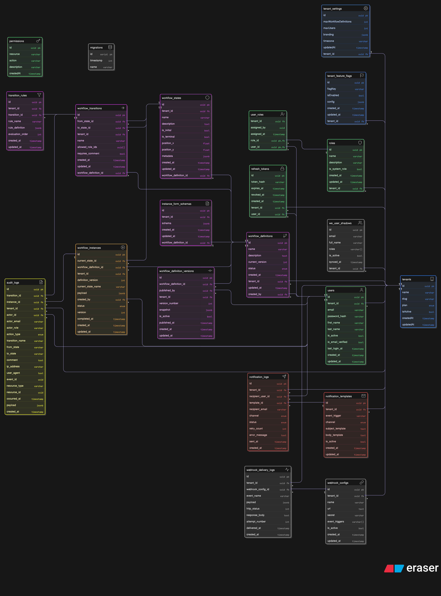

# Multi-Tenant Workflow Engine — Backend

A production-ready, multi-tenant SaaS backend for defining, deploying, and executing complex approval and routing workflows. Built as a strict modular monolith with contract-first inter-module communication — every module can be extracted as an independent microservice with zero business logic changes.

**Architecture**: Microservice-Extractable Contract-First Modular Monolith

**Runtime**: Bun on NestJS 10 · TypeScript 5 · PostgreSQL · Redis · NATS

---

## Table of Contents

- [What This System Does](#what-this-system-does)
- [Architecture at a Glance](#architecture-at-a-glance)
- [Tech Stack](#tech-stack)
- [Project Structure](#project-structure)
- [Prerequisites](#prerequisites)
- [Local Development Setup](#local-development-setup)
- [Environment Variables](#environment-variables)
- [Running the Application](#running-the-application)
- [Database & Migrations](#database--migrations)
- [Running Tests](#running-tests)
- [API Documentation (Swagger)](#api-documentation-swagger)
- [Key Architectural Concepts](#key-architectural-concepts)
- [Module Overview](#module-overview)
- [Scripts Reference](#scripts-reference)
- [Related Documentation](#related-documentation)

---

## What This System Does

Tenants onboard, define workflow state machines (e.g. a Leave Approval process with states `DRAFT → SUBMITTED → APPROVED/REJECTED`), attach business rules to transitions, and launch workflow instances. Users with the appropriate roles execute transitions, triggering rule evaluation, audit logging, and webhook/email notifications — all in real time.

Core capabilities:

- **Multi-tenancy** — strict database-level tenant isolation via PostgreSQL Row-Level Security on all 19 tenant-scoped tables
- **Workflow definition** — stateful, versioned, snapshot-immutable workflow graphs with per-transition role restrictions and JSON rule conditions
- **Workflow execution** — optimistic-locked state machine with CQRS command/query separation
- **Rule engine** — composable JSON-defined rules evaluated per transition via `json-rules-engine`
- **Audit trail** — immutable, append-only PostgreSQL event log protected by a database trigger
- **Notifications** — email (SMTP via Nodemailer + Pug templates) and webhook delivery with configurable retry

---

## Architecture at a Glance

### Production Grade Architecture


```
                     ┌──────────────────────────────────────────────────┐
  HTTP Client ──────▶│  NestJS Application (Bun runtime, PORT 10000)    │
                     │                                                  │
                     │  Global Pipeline:                                │
                     │  JwtAuthGuard → TenantIsolationGuard             │
                     │  → RolesGuard → ValidationPipe                   │
                     │  → DatabaseContextInterceptor (SET app.tenant_id)│
                     │  → LoggingInterceptor                            │
                     │  → GlobalExceptionFilter                         │
                     │                                                  │
                     │  Modules (each owns its own tables):             │
                     │  Auth · Tenant · WorkflowDefinition              │
                     │  WorkflowExecution (CQRS) · RuleEngine           │
                     │  Audit · Notification · Dashboard                │
                     └────────────┬──────────────────────┬──────────────┘
                                  │                      │
                         ┌────────▼───────┐    ┌─────────▼──────┐
                         │  PostgreSQL    │    │  Redis         │
                         │  + RLS Policies│    │  Cache +       │
                         └────────────────┘    │  Rate Limiter  │
                                               └────────────────┘
                                  │
                         ┌────────▼──────────────┐
                         │  NATS (embedded)      │
                         │  14 domain events     │
                         │  Audit + Notification │
                         │  subscribers          │
                         └───────────────────────┘
```

**Three inter-module communication patterns (no cross-module DB imports ever):**

| Pattern                           | When                                          | Example                                              |
| --------------------------------- | --------------------------------------------- | ---------------------------------------------------- |
| JWT Claims                        | Data about the current user                   | `@CurrentUser()` — zero DB call                      |
| Contract Interface (Symbol token) | Synchronous lookup of another module's entity | `@Inject(USER_QUERY_CONTRACT)`                       |
| Shadow Read Model (NATS-synced)   | High-frequency join data                      | `we_user_shadows` table in `WorkflowExecutionModule` |

---

## Tech Stack

| Concern              | Technology                                    | Version               |
| -------------------- | --------------------------------------------- | --------------------- |
| Runtime              | Bun                                           | `^1.0` (alpine)       |
| Framework            | NestJS                                        | `^10.0.0`             |
| Language             | TypeScript                                    | `^5.1.3`              |
| Database             | PostgreSQL                                    | 15+                   |
| ORM                  | TypeORM                                       | `^0.3.28`             |
| Cache / Rate Limiter | Redis (ioredis)                               | `^5.10.0`             |
| Message Broker       | NATS                                          | `^2.29.3`             |
| Password Hashing     | Argon2id                                      | `^0.44.0`             |
| Rule Engine          | json-rules-engine                             | `^7.3.1`              |
| Auth                 | @nestjs/jwt + @nestjs/passport                | `^11.0.2` / `^11.0.5` |
| Rate Limiting        | @nestjs/throttler + custom Redis leaky bucket | `^6.5.0`              |
| HTTP Security        | Helmet, csurf, hpp, xss-clean                 | latest                |
| API Docs             | @nestjs/swagger (non-prod only)               | `^11.2.6`             |
| Email                | @nestjs-modules/mailer + Nodemailer + Pug     | `^2.0.2`              |
| Logging              | Winston + nest-winston                        | `^3.19.0`             |
| Validation           | class-validator + class-transformer           | `^0.15.1`             |
| Testing              | Jest + Supertest                              | `^29.5.0`             |
| CQRS                 | @nestjs/cqrs                                  | `^10.0.3`             |

---

## Project Structure

```
backend/
├── src/
│   ├── main.ts                          # Bootstrap: Helmet, CSRF, NATS hybrid, ValidationPipe
│   ├── app.module.ts                    # Root module: global guards, interceptors, filters
│   ├── modules/
│   │   ├── auth/                        # User auth, JWT issuance, refresh tokens
│   │   │   ├── controllers/
│   │   │   ├── services/                # auth.service.ts — login, refresh, logout
│   │   │   ├── entities/                # users, roles, permissions, user_roles, refresh_tokens
│   │   │   ├── repositories/
│   │   │   ├── publishers/              # AuthPublisher — NATS auth events
│   │   │   └── guards/
│   │   ├── tenant/                      # Tenant lifecycle, settings, feature flags
│   │   │   ├── services/
│   │   │   │   └── tenant-provisioning.service.ts
│   │   │   ├── entities/                # tenants, tenant_settings, tenant_feature_flags
│   │   │   └── publishers/
│   │   ├── workflow-definition/         # Workflow graph authoring and versioning
│   │   │   ├── services/
│   │   │   │   └── workflow-version.service.ts  # Snapshot creation
│   │   │   ├── entities/                # definitions, versions, states, transitions, rules
│   │   │   └── publishers/
│   │   ├── workflow-execution/          # CQRS execution engine
│   │   │   ├── commands/                # CreateInstanceCommand, ExecuteTransitionCommand
│   │   │   ├── queries/                 # GetInstanceDetailQuery, GetInstanceListQuery
│   │   │   ├── handlers/
│   │   │   │   ├── execute-transition.handler.ts  # 11-step transition flow
│   │   │   │   └── create-instance.handler.ts
│   │   │   ├── entities/                # workflow_instances, we_user_shadows
│   │   │   ├── subscribers/
│   │   │   │   └── auth-events.subscriber.ts    # Shadow table sync (Pattern 3)
│   │   │   └── publishers/              # ExecutionPublisher — transition events
│   │   ├── rule-engine/                 # Stateless JSON rule evaluation
│   │   │   ├── services/
│   │   │   │   └── rule-engine.service.ts
│   │   │   └── evaluators/
│   │   │       ├── condition.evaluator.ts     # json-rules-engine (fresh Engine per call)
│   │   │       └── custom-rule.evaluator.ts   # Custom strategy pattern
│   │   ├── audit/                       # Immutable append-only audit log
│   │   │   ├── entities/                # audit_logs (no updated_at, trigger-protected)
│   │   │   └── subscribers/
│   │   │       └── audit.subscriber.ts  # Subscribes to ALL 14 NATS events
│   │   ├── notification/                # Email + webhook delivery
│   │   │   ├── entities/                # notification_templates, logs, webhook_configs
│   │   │   └── templates/               # Pug email templates
│   │   ├── dashboard/                   # Aggregated read-only stats
│   │   ├── database/
│   │   │   └── migrations/
│   │   │       ├── 1772830603496-Migration.ts          # All 22 tables + indexes
│   │   │       └── 1772830604496-Create-RLS-Policies.ts # 19 RLS policies + audit trigger
│   │   └── health/                      # /health and /health/ready endpoints
│   └── infra/
│       ├── cache-keys.ts                # 23 Redis key patterns (namespaced by module)
│       ├── cache-ttl.ts                 # SHORT=60s, MEDIUM=5m, LONG=1h, IMMUTABLE=24h
│       ├── redis.service.ts             # get/set/del/setNX/delByPattern
│       ├── nats.config.ts               # maxReconnectAttempts=-1, reconnectTimeWait=2000
│       ├── middlewares/
│       │   └── enhanced-rate-limit.middleware.ts  # Leaky bucket Lua script
│       └── configs/
│           └── ormconfig.ts             # pool max=20, idleTimeout=30s, queryTimeout=1000
├── libs/
│   └── shared/
│       └── src/
│           ├── constants/
│           │   └── nats-events.enum.ts  # All 14 NATS event subjects
│           ├── guards/                  # jwt-auth, tenant-isolation, roles
│           ├── filters/                 # global-exception.filter.ts
│           ├── interceptors/            # logging, tenant-context, database-context
│           ├── decorators/              # @CurrentUser(), @Roles(), @TenantId()
│           └── interfaces/
│               ├── contracts/           # 7 cross-module Symbol-token contracts
│               ├── events/              # All NATS event payload interfaces
│               └── jwt-payload.interface.ts
├── Dockerfile                           # FROM oven/bun:1-alpine, EXPOSES 10000
├── nest-cli.json
├── package.json
├── tsconfig.json
├── AGENT_PROMPT.md                      # 13 architectural constraints (read this first)
├── ENVIRONMENT_SETUP.md
├── WORKFLOW_EXECUTION.md
├── SCHEMA_DESIGN_PHILOSOPHY.md
├── RLS_IMPLEMENTATION_STRATEGY.md
└── TENANT_RATE_LIMITING.md
```

### Entity Relationship Diagram: Refer `docs/05-DATABASE-DESIGN.md` for details



---

## Prerequisites

| Requirement     | Version | Notes                                         |
| --------------- | ------- | --------------------------------------------- |
| **Bun**         | 1.x     | `curl -fsSL https://bun.sh/install \| bash`   |
| **PostgreSQL**  | 15+     | Must support RLS (`FORCE ROW LEVEL SECURITY`) |
| **Redis**       | 7+      | Required for cache + rate limiting            |
| **NATS Server** | 2.12+   | Embedded in Docker; external for multi-pod    |
| **Node.js**     | 20+     | Only needed if not using Bun for everything   |

---

## Local Development Setup

### 1. Clone and install

```bash
git clone <repo-url>
cd backend
bun install
```

### 2. Start infrastructure dependencies

```bash
# PostgreSQL
docker run -d \
  --name workflow-postgres \
  -e POSTGRES_USER=postgres \
  -e POSTGRES_PASSWORD=postgres \
  -e POSTGRES_DB=workflow-engine \
  -p 5432:5432 \
  postgres:15-alpine

# Redis
docker run -d \
  --name workflow-redis \
  -p 6379:6379 \
  redis:7-alpine

# NATS (embedded in Docker image — for local dev, install separately)
docker run -d \
  --name workflow-nats \
  -p 4222:4222 \
  nats:2.12-alpine
```

Or use a `docker-compose.dev.yml`:

```yaml
version: "3.8"
services:
  postgres:
    image: postgres:15-alpine
    environment:
      POSTGRES_USER: postgres
      POSTGRES_PASSWORD: postgres
      POSTGRES_DB: workflow-engine
    ports: ["5432:5432"]
  redis:
    image: redis:7-alpine
    ports: ["6379:6379"]
  nats:
    image: nats:2.12-alpine
    ports: ["4222:4222"]
```

```bash
docker compose -f docker-compose.dev.yml up -d
```

### 3. Configure environment

```bash
cp .env .env.stage.dev
# Edit .env.stage.dev with your local values (see Environment Variables below)
```

### 4. Run database migrations

```bash
bun run migration:run
```

### 5. Start the development server

```bash
bun run start:dev
# Server starts at http://localhost:10000
# Swagger UI at http://localhost:10000/api/docs (dev/staging only)
```

---

## Environment Variables

The application validates all environment variables at startup via a Joi schema (`libs/shared/src/utils/env.validation.ts`). Missing required variables cause a descriptive startup failure.

Environment files are loaded by stage: `.env.stage.dev`, `.env.stage.staging`, `.env.stage.uat`, `.env.stage.prod`. Set the `STAGE` environment variable to select the file.

### Required Variables

| Variable                  | Example                  | Description                                                  |
| ------------------------- | ------------------------ | ------------------------------------------------------------ |
| `NODE_ENV`                | `development`            | Node environment mode                                        |
| `STAGE`                   | `dev`                    | Selects `.env.stage.<STAGE>` file                            |
| `PORT`                    | `10000`                  | HTTP server port (Render uses 10000)                         |
| `DB_HOST`                 | `localhost`              | PostgreSQL host                                              |
| `DB_PORT`                 | `5432`                   | PostgreSQL port                                              |
| `DB_USER`                 | `postgres`               | PostgreSQL user                                              |
| `DB_PASSWORD`             | `yourpassword`           | PostgreSQL password                                          |
| `DATABASE`                | `workflow-engine`        | PostgreSQL database name                                     |
| `REDIS_URL`               | `redis://localhost:6379` | Redis connection URL                                         |
| `JWT_SECRET`              | _(32+ chars)_            | JWT signing secret — generate with `openssl rand -base64 32` |
| `JWT_EXPIRES_IN`          | `15m`                    | Access token expiry                                          |
| `JWT_REFRESH_EXPIRY_DAYS` | `7`                      | Refresh token validity in days                               |
| `SESSION_SECRET`          | _(16+ chars)_            | Express session secret                                       |
| `NATS_URL`                | `nats://localhost:4222`  | NATS broker URL                                              |
| `EMAIL_HOST`              | `smtp.mailtrap.io`       | SMTP host                                                    |
| `EMAIL_PORT`              | `2525`                   | SMTP port                                                    |
| `EMAIL_USERNAME`          | `user@smtp.io`           | SMTP username                                                |
| `EMAIL_PASSWORD`          | `password`               | SMTP password                                                |
| `SMTP_FROM`               | `noreply@example.com`    | From address for transactional emails                        |
| `FR_BASE_URL`             | `http://localhost:8000`  | Frontend base URL (used in email links)                      |
| `THROTTLE_TTL`            | `60000`                  | Global throttle window in milliseconds                       |
| `THROTTLE_LIMIT`          | `2000`                   | Global request limit per window                              |

### Optional Variables

| Variable                 | Default     | Description                         |
| ------------------------ | ----------- | ----------------------------------- |
| `GOOGLE_CLIENT_ID`       | —           | OAuth2 Google client ID             |
| `GOOGLE_CLIENT_SECRET`   | —           | OAuth2 Google client secret         |
| `AWS_REGION`             | `us-east-1` | AWS region for S3 / Secrets Manager |
| `AWS_ACCESS_KEY`         | —           | AWS IAM access key                  |
| `AWS_SECRET_ACCESS_KEY`  | —           | AWS IAM secret key                  |
| `AWS_SECRET_NAME`        | —           | AWS Secrets Manager ARN             |
| `AWS_PUBLIC_BUCKET_NAME` | —           | S3 bucket for file uploads          |

### Generating secrets

```bash
# JWT_SECRET (must be 32+ characters)
JWT_SECRET=$(openssl rand -base64 32)

# SESSION_SECRET (must be 16+ characters)
SESSION_SECRET=$(openssl rand -base64 24)
```

---

## Running the Application

| Command                    | Description                                        |
| -------------------------- | -------------------------------------------------- |
| `bun run start:dev`        | Development mode with file watching (`STAGE=dev`)  |
| `bun run start:staging`    | Staging mode with file watching                    |
| `bun run start:uat`        | UAT mode with file watching                        |
| `bun run start:prod`       | Production mode (`node dist/main`)                 |
| `bun run start:uat:docker` | Production binary via Bun (`bun dist/src/main.js`) |
| `bun run build`            | Compile TypeScript to `dist/`                      |

The application starts on `PORT` (default `10000`). On startup it:

1. Loads and validates all environment variables
2. Bootstraps the Bun/Node.js HTTP server
3. Applies global Helmet CSP headers
4. Registers CSRF middleware (`csurf`)
5. Initialises the NATS hybrid microservice transport
6. Validates the TypeORM `DataSource` connection to PostgreSQL
7. Starts the Express HTTP server and NATS subscriber

NATS server is **embedded** in the Docker image (`start.sh` launches it before the NestJS process). For multi-pod or external deployments, set `NATS_URL` to an external NATS server URL.

---

## Database & Migrations

TypeORM is configured with `synchronize: false` in all environments. All schema changes must go through migration files.

### Running migrations

```bash
# Run all pending migrations
bun run migration:run

# Revert the last migration
bun run migration:revert

# Create a new empty migration file
bun run migration:create

# Generate a migration from entity changes (diff)
bun run migration:generate
```

### Migration files

| File                                                                   | Description                                                                                |
| ---------------------------------------------------------------------- | ------------------------------------------------------------------------------------------ |
| `src/modules/database/migrations/1772830603496-Migration.ts`           | All 22 tables, composite indexes, constraints, and foreign keys                            |
| `src/modules/database/migrations/1772830604496-Create-RLS-Policies.ts` | PostgreSQL RLS policies for 19 tenant-scoped tables + immutability trigger on `audit_logs` |

### Row-Level Security

Every tenant-scoped table has `FORCE ROW LEVEL SECURITY` with the policy:

```sql
USING (tenant_id = current_setting('app.tenant_id')::uuid)
```

The `DatabaseContextInterceptor` executes `SELECT set_config('app.tenant_id', $tenantId, true)` before every request, activating RLS for the duration of that database session. This means cross-tenant data access is **blocked at the database level** even if application code omits a `WHERE tenant_id = $1` clause.

---

## Running Tests

```bash
# Unit tests
bun run test

# Unit tests with coverage
bun run test:cov

# Watch mode
bun run test:watch

# End-to-end tests
bun run test:e2e

# E2E watch mode
bun run test:e2e:watch
```

Tests use `@nestjs/testing` with mocked repositories and Redis. Integration tests require a running PostgreSQL with RLS policies applied. Set `STAGE=test` to point tests at a dedicated test database (`workflow-engine-test`).

---

## API Documentation (Swagger)

Swagger UI is available **only in non-production environments** (`STAGE !== 'prod'`):

```
http://localhost:10000/api/docs
```

The OpenAPI spec can be exported as JSON from `http://localhost:10000/api/docs-json`. The raw spec is also committed at `OPEN_API_SPEC.json` in the project root.

All endpoints require:

- `Authorization: Bearer <access_token>` header
- `X-CSRF-Token` header (fetched from `GET /api/auth/csrf-token`)

---

## Key Architectural Concepts

### 1. Module Boundaries Are Absolute

No module's repository, entity, or service class is ever imported by another module. The only crossing points are:

- **Symbol-token Contract Interfaces** — defined in `libs/shared/src/interfaces/contracts/`
- **NATS events** — published and consumed via subjects in `NatsEvents` enum
- **JWT claims** — `@CurrentUser()` reads from the request's JWT payload

Violating this constraint breaks microservice extraction. If you need data from another module, use one of the three patterns documented in `AGENT_PROMPT.md §Constraint 2`.

### 2. The Global Request Pipeline

Every authenticated request passes through this chain, in order:

```
EnhancedRateLimitMiddleware (Redis leaky bucket)
  → JwtAuthGuard (validates JWT, populates request.user)
    → TenantIsolationGuard (asserts tenantId in JWT)
      → RolesGuard (@Roles decorator check)
        → ValidationPipe (DTO validation, whitelist: true)
          → TenantContextInterceptor
            → DatabaseContextInterceptor (SET LOCAL app.tenant_id)
              → LoggingInterceptor
                → [Controller Handler]
                  → ClassSerializerInterceptor (response serialization)
                    → GlobalExceptionFilter (normalises all errors)
```

### 3. Optimistic Locking on Workflow Instances

`workflow_instances` has a `version` column. Every transition execution:

1. Reads the current `version` from the snapshot or cache.
2. Executes `UPDATE workflow_instances SET version = version + 1 WHERE id = $1 AND version = $expectedVersion`.
3. If 0 rows are updated, throws `409 TRANSITION_CONFLICT` — another request executed a transition concurrently.

### 4. Immutable Audit Logs

`audit_logs` has no `updated_at` column. A PostgreSQL trigger (`BEFORE UPDATE OR DELETE`) raises an exception on any attempt to modify or delete an audit row. The `AuditSubscriber` is the only writer — it subscribes to all 14 NATS events and calls `auditLogRepository.insertIfAbsent(eventId)` (idempotent).

### 5. Versioned, Immutable Workflow Snapshots

When a workflow definition is published, `WorkflowVersionService` serialises the entire graph — states, transitions, rules, form schemas — into `workflow_definition_versions.snapshot` (JSONB). Running instances use the snapshot, not live rows. Snapshots are cached with 24-hour IMMUTABLE TTL and never invalidated.

### 6. Rate Limiting — Dual Layer

- **Layer 1 (primary):** Redis leaky bucket via `EnhancedRateLimitMiddleware`. Tenant: 1000 burst / 600 rpm. User: 200 burst / 120 rpm. Implemented as a single atomic Lua script.
- **Layer 2 (backup):** NestJS `ThrottlerGuard` with in-memory store — activates if Redis is unavailable.

---

## Module Overview

| Module                       | Directory                          | Responsibility                                                                  | Contracts Exported                                      |
| ---------------------------- | ---------------------------------- | ------------------------------------------------------------------------------- | ------------------------------------------------------- |
| **AuthModule**               | `src/modules/auth/`                | User registration/login, JWT issuance, refresh tokens, RBAC, Google OAuth       | `USER_QUERY_CONTRACT`                                   |
| **TenantModule**             | `src/modules/tenant/`              | Tenant CRUD, settings, feature flags, provisioning                              | `TENANT_QUERY_CONTRACT`, `TENANT_PROVISIONING_CONTRACT` |
| **WorkflowDefinitionModule** | `src/modules/workflow-definition/` | Workflow design, state/transition/rule authoring, versioning, publish/deprecate | `WORKFLOW_QUERY_CONTRACT`                               |
| **WorkflowExecutionModule**  | `src/modules/workflow-execution/`  | CQRS instance lifecycle, transition execution, optimistic locking               | `WORKFLOW_EXECUTION_QUERY_CONTRACT`                     |
| **RuleEngineModule**         | `src/modules/rule-engine/`         | Stateless JSON rule evaluation, custom strategy dispatch                        | `RULE_ENGINE_CONTRACT`                                  |
| **AuditModule**              | `src/modules/audit/`               | Immutable audit log, NATS event consumer, idempotent insert                     | —                                                       |
| **NotificationModule**       | `src/modules/notification/`        | Email + webhook delivery, template management                                   | `NOTIFICATION_TEMPLATE_BOOTSTRAP_CONTRACT`              |
| **DashboardModule**          | `src/modules/dashboard/`           | Aggregated stats for the frontend dashboard                                     | —                                                       |
| **HealthModule**             | `src/modules/health/`              | `/health` (liveness) and `/health/ready` (readiness) endpoints                  | —                                                       |
| **DatabaseModule**           | `src/modules/database/`            | TypeORM DataSource, migrations, connection pool                                 | —                                                       |

---

## Scripts Reference

| Script               | Command                      |
| -------------------- | ---------------------------- |
| Install dependencies | `bun install`                |
| Start (dev)          | `bun run start:dev`          |
| Start (prod)         | `bun run start:prod`         |
| Build                | `bun run build`              |
| Lint                 | `bun run lint`               |
| Format               | `bun run format`             |
| Test (unit)          | `bun run test`               |
| Test (coverage)      | `bun run test:cov`           |
| Test (E2E)           | `bun run test:e2e`           |
| Run migrations       | `bun run migration:run`      |
| Revert migration     | `bun run migration:revert`   |
| Create migration     | `bun run migration:create`   |
| Generate migration   | `bun run migration:generate` |
| Generate TypeDoc     | `bun run typedoc`            |

---

## Related Documentation

All documentation lives in the project's `docs/` folder:

| Document                         | Description                                                            |
| -------------------------------- | ---------------------------------------------------------------------- |
| `01-SYSTEM-ARCHITECTURE.md`      | Full architectural philosophy, module boundaries, technology decisions |
| `02-HIGH-LEVEL-DESIGN.md`        | System flows, component interactions, frontend/backend integration     |
| `03-LOW-LEVEL-DESIGN.md`         | Class-level design, patterns, algorithms, CQRS deep dive               |
| `04-DOMAIN-MODEL-DDD.md`         | Aggregates, bounded contexts, domain events, ubiquitous language       |
| `05-DATABASE-DESIGN.md`          | Full schema, RLS policies, index catalogue, migration strategy         |
| `06-API-DESIGN.md`               | REST API reference, error codes, rate limiting, OpenAPI appendix       |
| `07-SECURITY-DESIGN.md`          | Threat model, auth design, tenant isolation, rate limiting             |
| `08-SCALABILITY-PERFORMANCE.md`  | Caching strategy, DB tuning, NATS vs Kafka, horizontal scaling         |
| `09-PRD.md`                      | Product requirements, user stories, API integration contract           |
| `10-MIGRATION-GUIDE.md`          | Modular monolith → microservices phased migration playbook             |
| `11-FAQ.md`                      | All 36 architectural decision questions answered                       |
| `AGENT_PROMPT.md`                | 13 hard architectural constraints every contributor must read          |
| `ENVIRONMENT_SETUP.md`           | Detailed environment variable guide                                    |
| `WORKFLOW_EXECUTION.md`          | Leave approval walkthrough, execution engine step-by-step              |
| `SCHEMA_DESIGN_PHILOSOPHY.md`    | Why minimal ORM relations; aggregate root pattern                      |
| `RLS_IMPLEMENTATION_STRATEGY.md` | PostgreSQL RLS design rationale and implementation                     |
| `TENANT_RATE_LIMITING.md`        | Leaky bucket algorithm, dual-tier rate limiting design                 |
