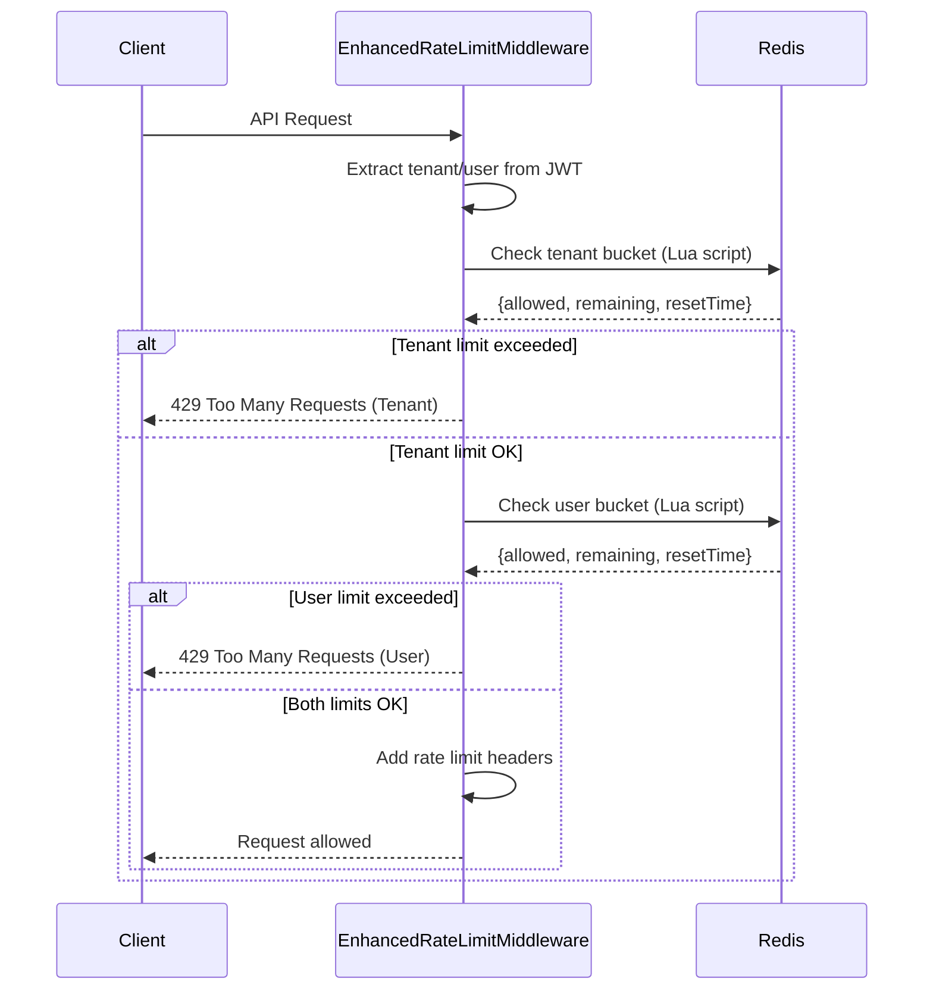

# Tenant Rate Limiting Strategy

## Overview

This document describes the **per-tenant rate limiting strategy** implemented to solve the **noisy neighbor problem** in our multi-tenant workflow engine. The solution uses a **leaky bucket algorithm** to provide smooth, fair rate limiting across tenants.

## Problem Statement

### Noisy Neighbor Problem
In multi-tenant systems, one tenant's excessive API usage can degrade performance for all other tenants:
- **Resource monopolization**: Heavy users consume disproportionate system resources
- **Performance degradation**: Other tenants experience slower response times
- **System instability**: Traffic spikes can overwhelm the entire system

### Previous Limitations
The original [`RateLimitMiddleware`](src/infra/middlewares/rate-limit.middleware.ts) used fixed time windows:
- **Thundering herd**: All limits reset simultaneously causing traffic spikes
- **Burst unfriendly**: No tolerance for legitimate traffic bursts
- **Unfair allocation**: No isolation between tenant usage patterns

## Solution: Enhanced Rate Limiting

### Implementation
**Single File Solution**: [`EnhancedRateLimitMiddleware`](src/infra/middlewares/enhanced-rate-limit.middleware.ts)

### Key Features
1. **Per-tenant isolation** using separate Redis buckets
2. **Leaky bucket algorithm** for smooth rate limiting
3. **Dual-level protection** (tenant + user limits)
4. **Atomic operations** using Lua scripts
5. **Graceful degradation** when Redis is unavailable

## Rate Limiting Tiers

### Tenant-Level Limits
Prevents any single tenant from overwhelming the system:
- **Burst Capacity**: 1,000 requests
- **Sustained Rate**: 600 requests/minute (10 requests/second)
- **Bucket Key**: `wf-bucket:{tenantId}:tenant`

### User-Level Limits
Prevents individual users from overwhelming their tenant's quota:
- **Burst Capacity**: 200 requests
- **Sustained Rate**: 120 requests/minute (2 requests/second)
- **Bucket Key**: `wf-bucket:{tenantId}:user:{userId}`

### Rate Limit Hierarchy
```
System Level
├── Tenant A (1000 burst, 600/min sustained)
│   ├── User 1 (200 burst, 120/min sustained)
│   ├── User 2 (200 burst, 120/min sustained)
│   └── User N...
├── Tenant B (1000 burst, 600/min sustained)
│   └── Users...
└── Tenant N...
```

## Leaky Bucket Algorithm

### How It Works
```
┌─────────────────┐
│   Token Bucket  │  ← Capacity: 1000 tokens
│                 │
│  ████████████   │  ← Current tokens: ~800
│                 │
└─────────────────┘
        │
        ▼ Leak Rate: 10 tokens/second
   (Sustained Rate)
```

### Benefits Over Fixed Windows
- **Smooth Traffic**: Tokens leak at constant rate, preventing spikes
- **Burst Tolerance**: Bucket capacity allows legitimate traffic bursts
- **Fair Distribution**: Each tenant gets isolated resource allocation
- **Predictable Performance**: Consistent token consumption prevents overload

## Implementation Details

### Atomic Operations with Lua Scripts
**Why Lua Scripts?**
- **Race Condition Prevention**: Multiple concurrent requests can't corrupt bucket state
- **Data Consistency**: Token calculations are atomic and accurate
- **Performance**: Single Redis round-trip instead of multiple operations
- **Precision**: Exact time-based token leaking calculations

### Example Lua Script Logic
```lua
-- Get current bucket state
local current_tokens = redis.call('HGET', key, 'tokens') or capacity
local last_refill = redis.call('HGET', key, 'last_refill') or now

-- Calculate tokens to leak based on elapsed time
local time_elapsed = (now - last_refill) / 1000
local tokens_to_leak = time_elapsed * leak_rate
current_tokens = max(0, current_tokens - tokens_to_leak)

-- Check if request is allowed
if current_tokens >= 1 then
  current_tokens = current_tokens - 1
  return {allowed: 1, remaining: current_tokens}
else
  return {allowed: 0, remaining: current_tokens}
end
```

## Request Flow



## Configuration

### Integration
Replace the basic rate limiting middleware in [`app.module.ts`](src/app.module.ts):

```typescript
// Before
consumer.apply(RateLimitMiddleware)

// After  
consumer.apply(EnhancedRateLimitMiddleware)
```

### Exemptions
- **Unauthenticated requests**: Skipped (handled by auth guards)
- **System administrators**: Bypass all rate limits
- **Health check endpoints**: Excluded from rate limiting

## Response Headers

The middleware provides comprehensive rate limit information:

```http
HTTP/1.1 200 OK
X-RateLimit-Limit: 200
X-RateLimit-Remaining: 156
X-RateLimit-Reset: 2024-03-05T12:25:00.000Z
X-RateLimit-Tenant-Remaining: 847
X-RateLimit-User-Remaining: 156
```

### Header Descriptions
- `X-RateLimit-Limit`: Most restrictive limit (tenant or user)
- `X-RateLimit-Remaining`: Tokens remaining for most restrictive limit
- `X-RateLimit-Reset`: When the most restrictive bucket will have capacity
- `X-RateLimit-Tenant-Remaining`: Tenant-level tokens remaining
- `X-RateLimit-User-Remaining`: User-level tokens remaining

## Error Responses

### Rate Limit Exceeded
```json
{
  "statusCode": 429,
  "message": "Too many requests from your organization",
  "retryAfter": 30
}
```

### User-Specific Limit
```json
{
  "statusCode": 429,
  "message": "Too many requests",
  "retryAfter": 15
}
```

## Monitoring and Observability

### Key Metrics to Monitor
- **Bucket utilization**: Current tokens vs capacity per tenant
- **Rate limit violations**: Frequency of 429 responses
- **Redis performance**: Lua script execution time
- **Tenant usage patterns**: Peak vs sustained usage

### Logging
The middleware logs rate limit violations:
```
WARN [EnhancedRateLimitMiddleware] Tenant rate limit exceeded [tenantId=tenant-123]
WARN [EnhancedRateLimitMiddleware] User rate limit exceeded [tenantId=tenant-123, userId=user-456]
```

## Operational Considerations

### Redis Requirements
- **Memory**: ~100 bytes per active bucket
- **Performance**: Supports 10,000+ requests/second per Redis instance
- **Persistence**: Buckets auto-expire after 1 hour of inactivity
- **Clustering**: Compatible with Redis cluster for horizontal scaling

### Fail-Safe Behavior
- **Redis unavailable**: Allows all requests through (fail-open)
- **Lua script errors**: Falls back to allowing requests
- **Invalid bucket state**: Resets to full capacity

### Capacity Planning
- **10,000 active tenants**: ~1MB Redis memory
- **100,000 requests/minute**: Easily handled by single Redis instance
- **Horizontal scaling**: Add Redis cluster nodes as needed

## Testing Strategy

### Unit Tests
```typescript
describe('EnhancedRateLimitMiddleware', () => {
  it('should allow requests within bucket capacity', async () => {
    // Test burst capacity
  });

  it('should deny requests when bucket is empty', async () => {
    // Test rate limiting
  });

  it('should leak tokens at correct rate', async () => {
    // Test leaky bucket algorithm
  });
});
```

### Load Testing
- **Burst traffic**: Verify bucket capacity handling
- **Sustained load**: Confirm leak rate accuracy
- **Multi-tenant**: Test isolation between tenants
- **Failover**: Verify Redis unavailability handling

## Future Enhancements

### Dynamic Rate Limits
- Adjust limits based on tenant subscription tier
- ML-based traffic pattern analysis
- Automatic scaling during high-traffic events

### Advanced Monitoring
- Real-time dashboards for rate limit metrics
- Predictive alerting for capacity planning
- Tenant usage analytics and reporting

### Performance Optimizations
- Redis pipelining for batch operations
- Connection pooling optimization
- Bucket state caching for frequently accessed tenants

## Troubleshooting

### Common Issues

#### High Redis CPU Usage
```bash
# Check Lua script performance
redis-cli --latency-history -i 1

# Monitor key patterns
redis-cli --scan --pattern "wf-bucket:*" | wc -l
```

#### Rate Limit False Positives
```typescript
// Check bucket status without consuming tokens
const status = await checkBucketStatus(tenantId, userId);
console.log('Current tokens:', status.remainingTokens);
```

#### Memory Usage Growth
```bash
# Check bucket expiry
redis-cli TTL "wf-bucket:tenant123:user456"

# Monitor memory usage
redis-cli INFO memory
```

## Redis Failure & Fallback Strategy

### Fail-Safe Behavior (Fail-Open)
When Redis fails, the system **allows all requests through** to prevent service disruption:

```typescript
// In EnhancedRateLimitMiddleware
try {
  const result = await this.redis.getClient().eval(/* Lua script */);
  // Normal rate limiting logic
} catch (err) {
  // ✅ FAIL-SAFE: Redis unavailable → pass through
  this.logger.warn("Enhanced rate limiting Redis error — passing through", err);
  next(); // Allow request to proceed
}
```

### Why Fail-Open vs Fail-Closed?
- **Fail-Open**: Service stays available, temporary loss of rate limiting
- **Fail-Closed**: Service becomes unavailable, but rate limiting maintained

**We chose Fail-Open** because:
1. **Service availability** is more critical than temporary rate limiting loss
2. **Redis outages** are typically brief and rare
3. **Other protections** still exist (ThrottlerGuard, database limits, etc.)

### Fallback Layers
```
Request → EnhancedRateLimit (Redis) → ThrottlerGuard → Your API
            ↓ (Redis fails)
Request → ✅ Allow → ThrottlerGuard → Your API
```

## ThrottlerModule Integration

### Current Configuration
Looking at [`app.module.ts`](src/app.module.ts), **ThrottlerModule is still active**:

```typescript
// Lines 36-45: ThrottlerModule is configured
ThrottlerModule.forRootAsync({
  imports: [ConfigModule],
  inject: [ConfigService],
  useFactory: (config: ConfigService) => [
    {
      ttl: +config.get<string>("THROTTLE_TTL"),
      limit: +config.get<string>("THROTTLE_LIMIT"),
    },
  ],
}),

// Line 73: ThrottlerGuard is active as APP_GUARD
{ provide: APP_GUARD, useClass: ThrottlerGuard },
```

### Dual Protection Strategy
You now have **TWO layers** of rate limiting:

```
1. EnhancedRateLimitMiddleware (Middleware level)
   ├── Per-tenant leaky bucket (Redis)
   ├── Sophisticated tenant isolation
   └── Fail-safe behavior
   
2. ThrottlerGuard (Guard level)
   ├── Basic global rate limiting
   ├── Memory-based (no Redis dependency)
   └── Backup protection when Redis fails
```

### Request Flow with Both Systems
```
Incoming Request
    ↓
1. EnhancedRateLimitMiddleware (runs first)
   ├── Redis available? → Per-tenant rate limiting
   └── Redis failed? → Allow through
    ↓
2. ThrottlerGuard (runs second)
   ├── Basic rate limiting (memory-based)
   └── Global limits (not tenant-aware)
    ↓
3. Your Controllers
```

### Benefits of Dual Protection

#### Normal Operation (Redis Available)
- **Primary**: EnhancedRateLimitMiddleware provides sophisticated per-tenant limiting
- **Backup**: ThrottlerGuard provides additional global protection

#### Redis Failure Scenario
- **Primary**: EnhancedRateLimitMiddleware fails-open (allows requests)
- **Backup**: ThrottlerGuard still provides basic rate limiting protection

#### Example Failure Scenario
```typescript
// Redis goes down at 10:00 AM
// EnhancedRateLimitMiddleware logs:
"Enhanced rate limiting Redis error — passing through"

// ThrottlerGuard still enforces:
// - Global limit: e.g., 100 requests per minute per IP
// - Prevents complete system overload
// - Basic protection until Redis recovers
```

### Protection Levels Summary
1. **Tenant-level**: 1000 burst, 600/min sustained (Redis-based)
2. **User-level**: 200 burst, 120/min sustained (Redis-based)
3. **Global-level**: Whatever your THROTTLE_LIMIT is set to (Memory-based backup)

## Data Storage Details

### Redis Key Structure
```
Redis Database
├── wf-bucket:tenant-123:tenant          ← Tenant-level bucket
│   ├── tokens: 847                      ← Current tokens available
│   └── last_refill: 1709559600000       ← Last update timestamp
│
├── wf-bucket:tenant-123:user:user-456   ← User-level bucket
│   ├── tokens: 156                      ← Current tokens available
│   └── last_refill: 1709559580000       ← Last update timestamp
│
├── wf-bucket:tenant-123:user:user-789   ← Another user in same tenant
│   ├── tokens: 89
│   └── last_refill: 1709559590000
│
└── wf-bucket:tenant-456:tenant          ← Different tenant
    ├── tokens: 1000
    └── last_refill: 1709559500000
```

### Data Structure in Redis
Each bucket is stored as a **Redis Hash**:
```bash
# Tenant bucket
HGETALL wf-bucket:tenant-123:tenant
1) "tokens"
2) "847"           # Current tokens available
3) "last_refill"
4) "1709559600000" # Timestamp of last update

# User bucket
HGETALL wf-bucket:tenant-123:user:user-456
1) "tokens"
2) "156"           # Current tokens available
3) "last_refill"
4) "1709559580000" # Timestamp of last update
```

### Real-World Example

#### Initial State
```
Redis:
├── wf-bucket:tenant-123:tenant (tokens: 1000, last_refill: 1709559600000)
├── wf-bucket:tenant-123:user:alice (tokens: 200, last_refill: 1709559600000)
└── wf-bucket:tenant-123:user:bob (tokens: 200, last_refill: 1709559600000)
```

#### Request Flow Example
1. **Alice makes API call**
   - Tenant bucket: 1000 → 999 tokens ✅ Allow
   - User bucket: 200 → 199 tokens ✅ Allow
   - Headers: `X-RateLimit-Remaining: 199`

2. **Bob makes API call (same tenant)**
   - Tenant bucket: 999 → 998 tokens ✅ Allow
   - User bucket: 200 → 199 tokens ✅ Allow
   - Headers: `X-RateLimit-Remaining: 199`

3. **After Alice exhausts her 200 requests**
   ```
   Redis:
   ├── wf-bucket:tenant-123:tenant (tokens: 800)
   └── wf-bucket:tenant-123:user:alice (tokens: 0)
   ```

4. **Alice's next request**
   - Tenant bucket: 800 tokens ✅ Allow
   - User bucket: 0 tokens ❌ **DENY**
   - Response: `429 Too Many Requests`

5. **Bob can still make requests** because he has his own bucket with 199 tokens remaining.

#### Token Recovery Over Time
After 60 seconds:
- Alice's bucket: 0 + (60 × 2) = 120 tokens recovered
- Alice can make requests again!

## Conclusion

The enhanced rate limiting strategy provides:
- **✅ Noisy neighbor prevention** through tenant isolation
- **✅ Smooth traffic flow** via leaky bucket algorithm
- **✅ Production reliability** with atomic operations and fail-safe behavior
- **✅ Graceful degradation** with dual-layer protection
- **✅ Operational visibility** through comprehensive monitoring

This solution ensures fair resource allocation while maintaining system stability and providing excellent user experience for all tenants, even during Redis outages.